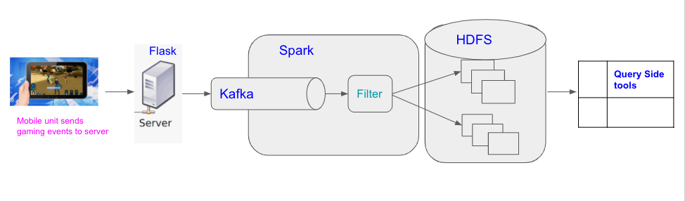
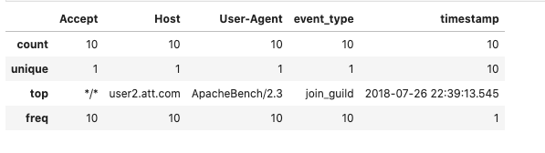

# Understanding User Behavior For Mobile Gaming

Author: David Trinidad  
MIDS W205 Data Engineering  
Project 3  


### Part I: Summary

The intention of this project is to demonstrate a basic pipeline for collecting user metadata within the mobile-gaming space. We will step through the process where data from a Flask web server will publish into Kafka where the messages will be ingested into Spark, and finish off by saving the data into a Hadoop file system (HDFS) where basic analytical quiries can be conducted to answer business questions. 

**Introduction**

As a Data Scientist of a gaming company, we take the scenario of tracking two events; "purchasing a sword" and "joining a guild". We assume these events are generated by a web interface of some sort. Below are the following tasks that will be highlighted during the step by step implementation process in section 3. 

**Tasks**  
- 1. Instrument API server to log events to Kafka: The web server will be used to log the events where users buy a sword or join guild as json messages. 
- 2. Assemble a data pipeline to catch these events: use Spark streaming to filter select event types from Kafka, land them into HDFS/parquet to make them available for analysis using Presto.  
- 3. Use Apache Bench to generate test data for your pipeline.  
- 4. Produce an analytics report providing a description of your pipeline and some basic analysis of the events. Explaining the pipeline is key for this project!  

**Files**

- **Report.md**: This file is the writeup with step-by-step command annotations.
- **docker-compose.yml**: Contains the cluster configuration
- **mobileGame_api.py**: Python API for the Web Server.
- **separate_events.py**: Python spark scripts to separate game event messages.
- **event_filtering.py**: Python spark scripts to filter game event messages.
- **filtered_writes.py**: is the Python spark scripts to save game event messages to file after filtering.
- **JupyterQuery.ipynb**: Jupyter Notebook to save demonstrate queries from saved data.


### Part II: Data Pipeline Architecture



### Part III: Step By Step Implementation Process 

**step 1: Create project directory**


```python
## make project directory 
mkdir -p w205/project_3

## Copy docker compose file from week 13 w205 course content
cp ~/w205/course-content//13-Querying-Data/docker-compose.yml .
cat docker-compose.yml
```
jupyter@python-20210907-215615:~/w205$ cp ../w205/course-content/13-Understanding-Data/docker-compose.yml .
jupyter@python-20210907-215615:~/w205$ cat docker-compose.yml  
---
version: '2'  
services:  
  zookeeper:  
    image: confluentinc/cp-zookeeper:latest  
    environment:  
      ZOOKEEPER_CLIENT_PORT: 32181  
      ZOOKEEPER_TICK_TIME: 2000  
    expose:  
      - "2181"  
      - "2888"  
      - "32181"  
      - "3888"  
    extra_hosts:  
      - "moby:127.0.0.1"  
  
  kafka:  
    image: confluentinc/cp-kafka:latest  
    depends_on:  
      - zookeeper  
    environment:  
      KAFKA_BROKER_ID: 1  
      KAFKA_ZOOKEEPER_CONNECT: zookeeper:32181  
      KAFKA_ADVERTISED_LISTENERS: PLAINTEXT://kafka:29092  
      KAFKA_OFFSETS_TOPIC_REPLICATION_FACTOR: 1  
    expose:  
      - "9092"  
      - "29092"  
    extra_hosts:  
      - "moby:127.0.0.1"  
   
  cloudera:  
    image: midsw205/cdh-minimal:latest  
    expose:  
      - "8020" # nn  
      - "50070" # nn http  
      - "8888" # hue  
    #ports:   
    #- "8888:8888"  
    extra_hosts:  
      - "moby:127.0.0.1"  

  spark:  
    image: midsw205/spark-python:0.0.5  
    stdin_open: true  
    tty: true  
    volumes:  
      - ~/w205:/w205  
    expose:  
      - "8888"  
    ports:  
      - "8888:8888"  
    depends_on:  
      - cloudera  
    environment:  
      HADOOP_NAMENODE: cloudera  
    extra_hosts:  
      - "moby:127.0.0.1"  
    command: bash  
  
  mids:  
    image: midsw205/base:0.1.9  
    stdin_open: true  
    tty: true  
    volumes:  
      - ~/w205:/w205  
    expose:  
      - "5000"  
    ports:  
      - "5000:5000"  
    extra_hosts:  
      - "moby:127.0.0.1"  
jupyter@python-20210907-215615:~/w205$   
**step 2: Execute docker container**

Services within the docker cluster include kafka, zookeeper, saprk and mids. 


```python
## Spin up docker cluster
docker-compose up -d
```

jupyter@python-20210907-215615:~/w205/w205/project_3$ docker-compose ps
        Name                       Command                State                      Ports                  
------------------------------------------------------------------------------------------------------------
project_3_cloudera_1    /usr/bin/docker-entrypoint ...   Exit 139                                           
project_3_kafka_1       /etc/confluent/docker/run        Up         29092/tcp, 9092/tcp                     
project_3_mids_1        /bin/bash                        Up         8888/tcp                                
project_3_presto_1      /usr/bin/docker-entrypoint ...   Up         8080/tcp                                
project_3_spark_1       docker-entrypoint.sh bash        Up         0.0.0.0:8889->8888/tcp,:::8889->8888/tcp
project_3_zookeeper_1   /etc/confluent/docker/run        Up         2181/tcp, 2888/tcp, 32181/tcp, 3888/tcp 
jupyter@python-20210907-215615:~/w205/w205/project_3$ 

**step 3: set up logs for hadoop and kafka**


```python
#set up monitor log for hadoop
docker-compose logs -f cloudera

#set up monitor log for kafka
docker-compose logs -f kafka

```


```python
Attaching to project_3_cloudera_1
project_3_cloudera_1 exited with code 139
```
jupyter@python-20210907-215615:~/w205/w205/project_3$ docker-compose exec cloudera hadoop fs -ls /tmp/
Found 2 items
drwxrwxrwt   - mapred mapred              0 2021-02-06 18:27 /tmp/hadoop-yarn
drwx-wx-wx   - root   supergroup          0 2021-07-21 16:09 /tmp/hive

**step 4: Create Kafka topic "Events"**


```python
docker-compose exec kafka 
```

jupyter@python-20210907-215615:~/w205/w205/project_3$ docker-compose exec kafka \
>    kafka-topics \
>      --create \
>      --topic events \
>      --partitions 1 \
>      --replication-factor 1 \
>      --if-not-exists \
>      --zookeeper zookeeper:32181
Created topic "events".

**step 5: Create the Web API (mobileGame_api.py)**

Below is the  mobileGame_api.py file. (This script was modified from the example from week 13 async)The code contains two Web API calls;1. buy_sword and join_guild. Both use the json to log the events to kafka. Moreover, meta data from user request was also added to the event logging. Finally, I enhanced the API to allow parameters in purchase_a_sword Web API.
#!/usr/bin/env python
"""Mobile Gaming API Web Calls"""

import json
from kafka import KafkaProducer
from flask import Flask, request


app = Flask(__name__)
event_logger = KafkaProducer(bootstrap_servers='kafka:29092')
events_topic = 'events'

def log_to_kafka(topic, event):
    event.update(request.headers)
    producer.send(topic, json.dumps(event).encode())

##Web call for joining guild event#    
@app.route("/join_guild")
def join_guild():
    join_guild_event = {'event_type': 'join_guild'}
    log_to_kafka(events_topic, join_guild_event)
    return "\nGuild joined!\n"

##Web call for purchase sword event#     
@app.route("/purchase_sword")
def purchase_sword():
    buy_sword_event = {'event_type': 'purchase_sword'}
    sword_parameter = request.args.to_dict()
    buy_sword_event.update(sword_parameter)
    log_to_kafka(events_topic, buy_sword_event)
    return "\nSword Purchased!\n"

**step 6: Run Flask**  
- Run flask withthe mobileGame_api.py
- launch the flask web server 


```python
##Code
docker-compose exec mids env FLASK_APP=/w205/project_3/mobileGame_api.py flask run --host 0.0.0.0
```

jupyter@python-20210907-215615:~/w205/w205/project_3$ docker-compose exec mids env FLASK_APP=/w205/project_3/mobileGame_api.py flask run --host 0.0.0.0
* Serving Flask app "game_api"
 * Running on http://0.0.0.0:5000/ (Press CTRL+C to quit)
127.0.0.1 - - [11/Dec/2021 20:16:27] "GET /purchase_a_sword HTTP/1.0" 200 -
127.0.0.1 - - [11/Dec/2021 20:16:27] "GET /purchase_a_sword HTTP/1.0" 200 -
127.0.0.1 - - [11/Dec/2021 20:16:27] "GET /purchase_a_sword HTTP/1.0" 200 -
127.0.0.1 - - [11/Dec/2021 20:16:27] "GET /purchase_a_sword HTTP/1.0" 200 -
127.0.0.1 - - [11/Dec/2021 20:16:27] "GET /purchase_a_sword HTTP/1.0" 200 -
127.0.0.1 - - [11/Dec/2021 20:16:27] "GET /purchase_a_sword HTTP/1.0" 200 -
127.0.0.1 - - [11/Dec/2021 20:16:27] "GET /purchase_a_sword HTTP/1.0" 200 -
127.0.0.1 - - [11/Dec/2021 20:16:27] "GET /purchase_a_sword HTTP/1.0" 200 -
127.0.0.1 - - [11/Dec/2021 20:16:27] "GET /purchase_a_sword HTTP/1.0" 200 -
127.0.0.1 - - [11/Dec/2021 20:16:27] "GET /purchase_a_sword HTTP/1.0" 200 -
127.0.0.1 - - [11/Dec/2021 20:17:32] "GET /join_guild HTTP/1.0" 200 -
127.0.0.1 - - [11/Dec/2021 20:17:32] "GET /join_guild HTTP/1.0" 200 -
127.0.0.1 - - [11/Dec/2021 20:17:32] "GET /join_guild HTTP/1.0" 200 -
127.0.0.1 - - [11/Dec/2021 20:17:32] "GET /join_guild HTTP/1.0" 200 -
127.0.0.1 - - [11/Dec/2021 20:17:32] "GET /join_guild HTTP/1.0" 200 -
127.0.0.1 - - [11/Dec/2021 20:17:32] "GET /join_guild HTTP/1.0" 200 -
127.0.0.1 - - [11/Dec/2021 20:17:32] "GET /join_guild HTTP/1.0" 200 -
127.0.0.1 - - [11/Dec/2021 20:17:32] "GET /join_guild HTTP/1.0" 200 -
127.0.0.1 - - [11/Dec/2021 20:17:32] "GET /join_guild HTTP/1.0" 200 -
127.0.0.1 - - [11/Dec/2021 20:17:32] "GET /join_guild HTTP/1.0" 200 -
127.0.0.1 - - [11/Dec/2021 20:17:24] "GET /purchase_a_sword HTTP/1.0" 200 -
127.0.0.1 - - [11/Dec/2021 20:17:25] "GET /purchase_a_sword HTTP/1.0" 200 -
127.0.0.1 - - [11/Dec/2021 20:17:25] "GET /purchase_a_sword HTTP/1.0" 200 -
127.0.0.1 - - [11/Dec/2021 20:17:25] "GET /purchase_a_sword HTTP/1.0" 200 -
127.0.0.1 - - [11/Dec/2021 20:17:25] "GET /purchase_a_sword HTTP/1.0" 200 -
127.0.0.1 - - [11/Dec/2021 20:17:25] "GET /purchase_a_sword HTTP/1.0" 200 -
127.0.0.1 - - [11/Dec/2021 20:17:25] "GET /purchase_a_sword HTTP/1.0" 200 -
127.0.0.1 - - [11/Dec/2021 20:17:25] "GET /purchase_a_sword HTTP/1.0" 200 -
127.0.0.1 - - [11/Dec/2021 20:17:25] "GET /purchase_a_sword HTTP/1.0" 200 -
127.0.0.1 - - [11/Dec/2021 20:17:25] "GET /purchase_a_sword HTTP/1.0" 200 -
127.0.0.1 - - [11/Dec/2021 20:19:13] "GET /join_guild HTTP/1.0" 200 -
127.0.0.1 - - [11/Dec/2021 20:19:13] "GET /join_guild HTTP/1.0" 200 -
127.0.0.1 - - [11/Dec/2021 20:19:13] "GET /join_guild HTTP/1.0" 200 -
127.0.0.1 - - [11/Dec/2021 20:19:13] "GET /join_guild HTTP/1.0" 200 -
127.0.0.1 - - [11/Dec/2021 20:19:13] "GET /join_guild HTTP/1.0" 200 -
127.0.0.1 - - [11/Dec/2021 20:19:13] "GET /join_guild HTTP/1.0" 200 -
127.0.0.1 - - [11/Dec/2021 20:19:13] "GET /join_guild HTTP/1.0" 200 -
127.0.0.1 - - [11/Dec/2021 20:19:13] "GET /join_guild HTTP/1.0" 200 -
127.0.0.1 - - [11/Dec/2021 20:19:13] "GET /join_guild HTTP/1.0" 200 -
127.0.0.1 - - [11/Dec/2021 20:19:13] "GET /join_guild HTTP/1.0" 200 -

**step 7: Apache Bench to generate data (**  
Utilizing a different terminal, below you can see Apache bench commands to generate Web API buy_a_sword and join_guild calls. Note that the output from the flask server matches with Apache bench commands.
jupyter@python-20210907-215615:~/w205/w205/project_3$ docker-compose exec mids ab -n 10 -H "Host: user1.comcast.com" http://localhost:5000/buy_a_sword
This is ApacheBench, Version 2.3 <$Revision: 1706008 $>
Copyright 1996 Adam Twiss, Zeus Technology Ltd, http://www.zeustech.net/
Licensed to The Apache Software Foundation, http://www.apache.org/

Benchmarking localhost (be patient).....done


Server Software:        Werkzeug/0.14.1
Server Hostname:        localhost
Server Port:            5000

Document Path:          /purchase_a_sword
Document Length:        18 bytes

Concurrency Level:      1
Time taken for tests:   0.028 seconds
Complete requests:      10
Failed requests:        0
Total transferred:      1730 bytes
HTML transferred:       180 bytes
Requests per second:    362.31 [#/sec] (mean)
Time per request:       2.760 [ms] (mean)
Time per request:       2.760 [ms] (mean, across all concurrent requests)
Transfer rate:          61.21 [Kbytes/sec] received

Connection Times (ms)
              min  mean[+/-sd] median   max
Connect:        0    0   0.1      0       0
Processing:     1    3   3.6      2      13
Waiting:        0    2   3.8      1      12
Total:          1    3   3.6      2      13

Percentage of the requests served within a certain time (ms)
  50%      2
  66%      2
  75%      2
  80%      2
  90%     13
  95%     13
  98%     13
  99%     13
 100%     13 (longest request)


```python
#code
docker-compose exec mids ab -n 10 -H "Host: user1.comcast.com" http://localhost:5000/join_guild
```
jupyter@python-20210907-215615:~/w205/w205/project_3$ docker-compose exec mids ab -n 10 -H "Host: user1.comcast.com" http://localhost:5000/join_guild
This is ApacheBench, Version 2.3 <$Revision: 1706008 $>
Copyright 1996 Adam Twiss, Zeus Technology Ltd, http://www.zeustech.net/
Licensed to The Apache Software Foundation, http://www.apache.org/

Benchmarking localhost (be patient).....done


Server Software:        Werkzeug/0.14.1
Server Hostname:        localhost
Server Port:            5000

Document Path:          /join_guild
Document Length:        15 bytes

Concurrency Level:      1
Time taken for tests:   0.049 seconds
Complete requests:      10
Failed requests:        0
Total transferred:      1700 bytes
HTML transferred:       150 bytes
Requests per second:    206.04 [#/sec] (mean)
Time per request:       4.854 [ms] (mean)
Time per request:       4.854 [ms] (mean, across all concurrent requests)
Transfer rate:          34.21 [Kbytes/sec] received

Connection Times (ms)
              min  mean[+/-sd] median   max
Connect:        0    0   0.3      0       1
Processing:     2    5   2.6      5      10
Waiting:        0    4   3.2      4      10
Total:          2    5   2.5      5      10

Percentage of the requests served within a certain time (ms)
  50%      5
  66%      5
  75%      6
  80%      8
  90%     10
  95%     10
  98%     10
  99%     10
 100%     10 (longest request)


```python
## Code
docker-compose exec mids ab -n 10 -H "Host: user2.att.com" http://localhost:5000/purchase_a_sword
```
jupyter@python-20210907-215615:~/w205/w205/project_3$  docker-compose exec mids ab -n 10 -H "Host: user2.att.com" http://localhost:5000/purchase_a_sword
This is ApacheBench, Version 2.3 <$Revision: 1706008 $>
Copyright 1996 Adam Twiss, Zeus Technology Ltd, http://www.zeustech.net/
Licensed to The Apache Software Foundation, http://www.apache.org/

Benchmarking localhost (be patient).....done


Server Software:        Werkzeug/0.14.1
Server Hostname:        localhost
Server Port:            5000

Document Path:          /purchase_a_sword
Document Length:        18 bytes

Concurrency Level:      1
Time taken for tests:   0.045 seconds
Complete requests:      10
Failed requests:        0
Total transferred:      1730 bytes
HTML transferred:       180 bytes
Requests per second:    222.90 [#/sec] (mean)
Time per request:       4.486 [ms] (mean)
Time per request:       4.486 [ms] (mean, across all concurrent requests)
Transfer rate:          37.66 [Kbytes/sec] received

Connection Times (ms)
              min  mean[+/-sd] median   max
Connect:        0    0   0.0      0       0
Processing:     2    4   3.5      4      11
Waiting:        1    4   3.6      2      11
Total:          2    4   3.5      4      11

Percentage of the requests served within a certain time (ms)
  50%      4
  66%      4
  75%      6
  80%     10
  90%     11
  95%     11
  98%     11
  99%     11
 100%     11 (longest request)


```python
#code
docker-compose exec mids ab -n 10 -H "Host: user2.att.com" http://localhost:5000/join_guild
```
jupyter@python-20210907-215615:~/w205/w205/project_3$ docker-compose exec mids ab -n 10 -H "Host: user2.att.com" http://localhost:5000/join_guild
This is ApacheBench, Version 2.3 <$Revision: 1706008 $>
Copyright 1996 Adam Twiss, Zeus Technology Ltd, http://www.zeustech.net/
Licensed to The Apache Software Foundation, http://www.apache.org/

Benchmarking localhost (be patient).....done


Server Software:        Werkzeug/0.14.1
Server Hostname:        localhost
Server Port:            5000

Document Path:          /join_guild
Document Length:        15 bytes

Concurrency Level:      1
Time taken for tests:   0.056 seconds
Complete requests:      10
Failed requests:        0
Total transferred:      1700 bytes
HTML transferred:       150 bytes
Requests per second:    177.58 [#/sec] (mean)
Time per request:       5.631 [ms] (mean)
Time per request:       5.631 [ms] (mean, across all concurrent requests)
Transfer rate:          29.48 [Kbytes/sec] received

Connection Times (ms)
              min  mean[+/-sd] median   max
Connect:        0    0   0.1      0       0
Processing:     3    6   2.7      6      10
Waiting:        0    3   2.1      3       6
Total:          3    6   2.7      6      11

Percentage of the requests served within a certain time (ms)
  50%      6
  66%      6
  75%      7
  80%      9
  90%     11
  95%     11
  98%     11
  99%     11
 100%     11 (longest request)


**step 8: Used kafkacat to monitor streaming messages into kafka**


```python
## monitor events into kafka port 29092
docker-compose exec mids kafkacat -C -b kafka:29092 -t events -o beginning
```
jupyter@python-20210907-215615:~/w205/w205/project_3$ docker-compose exec mids kafkacat -C -b kafka:29092 -t events -o beginning
{"Host": "user1.comcast.com", "event_type": "purchase_sword", "Accept": "*/*", "User-Agent": "ApacheBench/2.3"}
{"Host": "user1.comcast.com", "event_type": "purchase_sword", "Accept": "*/*", "User-Agent": "ApacheBench/2.3"}
{"Host": "user1.comcast.com", "event_type": "purchase_sword", "Accept": "*/*", "User-Agent": "ApacheBench/2.3"}
{"Host": "user1.comcast.com", "event_type": "purchase_sword", "Accept": "*/*", "User-Agent": "ApacheBench/2.3"}
{"Host": "user1.comcast.com", "event_type": "purchase_sword", "Accept": "*/*", "User-Agent": "ApacheBench/2.3"}
{"Host": "user1.comcast.com", "event_type": "purchase_sword", "Accept": "*/*", "User-Agent": "ApacheBench/2.3"}
{"Host": "user1.comcast.com", "event_type": "purchase_sword", "Accept": "*/*", "User-Agent": "ApacheBench/2.3"}
{"Host": "user1.comcast.com", "event_type": "purchase_sword", "Accept": "*/*", "User-Agent": "ApacheBench/2.3"}
{"Host": "user1.comcast.com", "event_type": "purchase_sword", "Accept": "*/*", "User-Agent": "ApacheBench/2.3"}
{"Host": "user1.comcast.com", "event_type": "purchase_sword", "Accept": "*/*", "User-Agent": "ApacheBench/2.3"}
{"Host": "user1.comcast.com", "event_type": "join_guild", "Accept": "*/*", "User-Agent": "ApacheBench/2.3"}
{"Host": "user1.comcast.com", "event_type": "join_guild", "Accept": "*/*", "User-Agent": "ApacheBench/2.3"}
{"Host": "user1.comcast.com", "event_type": "join_guild", "Accept": "*/*", "User-Agent": "ApacheBench/2.3"}
{"Host": "user1.comcast.com", "event_type": "join_guild", "Accept": "*/*", "User-Agent": "ApacheBench/2.3"}
{"Host": "user1.comcast.com", "event_type": "join_guild", "Accept": "*/*", "User-Agent": "ApacheBench/2.3"}
{"Host": "user1.comcast.com", "event_type": "join_guild", "Accept": "*/*", "User-Agent": "ApacheBench/2.3"}
{"Host": "user1.comcast.com", "event_type": "join_guild", "Accept": "*/*", "User-Agent": "ApacheBench/2.3"}
{"Host": "user1.comcast.com", "event_type": "join_guild", "Accept": "*/*", "User-Agent": "ApacheBench/2.3"}
{"Host": "user1.comcast.com", "event_type": "join_guild", "Accept": "*/*", "User-Agent": "ApacheBench/2.3"}
{"Host": "user1.comcast.com", "event_type": "join_guild", "Accept": "*/*", "User-Agent": "ApacheBench/2.3"}
{"Host": "user2.att.com", "event_type": "purchase_sword", "Accept": "*/*", "User-Agent": "ApacheBench/2.3"}
{"Host": "user2.att.com", "event_type": "purchase_sword", "Accept": "*/*", "User-Agent": "ApacheBench/2.3"}
{"Host": "user2.att.com", "event_type": "purchase_sword", "Accept": "*/*", "User-Agent": "ApacheBench/2.3"}
{"Host": "user2.att.com", "event_type": "purchase_sword", "Accept": "*/*", "User-Agent": "ApacheBench/2.3"}
{"Host": "user2.att.com", "event_type": "purchase_sword", "Accept": "*/*", "User-Agent": "ApacheBench/2.3"}
{"Host": "user2.att.com", "event_type": "purchase_sword", "Accept": "*/*", "User-Agent": "ApacheBench/2.3"}
{"Host": "user2.att.com", "event_type": "purchase_sword", "Accept": "*/*", "User-Agent": "ApacheBench/2.3"}
{"Host": "user2.att.com", "event_type": "purchase_sword", "Accept": "*/*", "User-Agent": "ApacheBench/2.3"}
{"Host": "user2.att.com", "event_type": "purchase_sword", "Accept": "*/*", "User-Agent": "ApacheBench/2.3"}
{"Host": "user2.att.com", "event_type": "purchase_sword", "Accept": "*/*", "User-Agent": "ApacheBench/2.3"}
{"Host": "user2.att.com", "event_type": "join_guild", "Accept": "*/*", "User-Agent": "ApacheBench/2.3"}
{"Host": "user2.att.com", "event_type": "join_guild", "Accept": "*/*", "User-Agent": "ApacheBench/2.3"}
{"Host": "user2.att.com", "event_type": "join_guild", "Accept": "*/*", "User-Agent": "ApacheBench/2.3"}
{"Host": "user2.att.com", "event_type": "join_guild", "Accept": "*/*", "User-Agent": "ApacheBench/2.3"}
{"Host": "user2.att.com", "event_type": "join_guild", "Accept": "*/*", "User-Agent": "ApacheBench/2.3"}
{"Host": "user2.att.com", "event_type": "join_guild", "Accept": "*/*", "User-Agent": "ApacheBench/2.3"}
{"Host": "user2.att.com", "event_type": "join_guild", "Accept": "*/*", "User-Agent": "ApacheBench/2.3"}
{"Host": "user2.att.com", "event_type": "join_guild", "Accept": "*/*", "User-Agent": "ApacheBench/2.3"}
{"Host": "user2.att.com", "event_type": "join_guild", "Accept": "*/*", "User-Agent": "ApacheBench/2.3"}
{"Host": "user2.att.com", "event_type": "join_guild", "Accept": "*/*", "User-Agent": "ApacheBench/2.3"}
**step 9:** filter kafka events  

- below is the event_filtering script for filtering the kafka events for "purchase_sword" and "join_guild"


```python
#!/usr/bin/env python
"""Python Spark Script for filtering event messages"""

from pyspark.sql import SparkSession, Row
from pyspark.sql.functions import udf
import json

@udf('boolean')
def is_purchase(event_as_json):
    event = json.loads(event_as_json)
    if event['event_type'] == 'purchase_sword':
        return True
    return False


def main():
    """main"""
    spark = SparkSession \
        .builder \
        .appName("ExtractEventsJob") \
        .getOrCreate()

    events_raw = spark \
        .read \
        .format("kafka") \
        .option("kafka.bootstrap.servers", "kafka:29092") \
        .option("subscribe", "events") \
        .option("startingOffsets", "earliest") \
        .option("endingOffsets", "latest") \
        .load()

    event_purchases = events_raw \
        .select(events_raw.value.cast('string').alias('raw'),
                events_raw.timestamp.cast('string')) \
        .filter(is_purchase('raw'))

    event_purchases_extracted = event_purchases \
        .rdd \
        .map(lambda r: Row(timestamp=r.timestamp, **json.loads(r.raw))) \
        .toDF()
    event_purchases_extracted.printSchema()
    event_purchases_extracted.show()


if __name__ == "__main__":
    main()

```

**step 10:** execute Spark service container with the filtering.py script

- For readability portions of the output was condensed or left out. 


```python
##code
docker-compose exec spark spark-submit /w205/project_3/event_filtering.py

```
jupyter@python-20210907-215615:~/w205/w205/project_3$ docker-compose exec spark spark-submit /w205/project_3/event_filtering.py
Using Spark's default log4j profile: org/apache/spark/log4j-defaults.properties
21/12/11 21:15:50 INFO SparkContext: Running Spark version 2.2.0

###Output Condensed###

21/12/11 21:16:11 INFO DAGScheduler: ResultStage 1 (showString at NativeMethodAccessorImpl.java:0) finished in 0.259 s
21/12/11 21:16:11 INFO DAGScheduler: Job 1 finished: showString at NativeMethodAccessorImpl.java:0, took 0.287336 s
21/12/11 21:16:12 INFO CodeGenerator: Code generated in 16.815289 ms
+------+-----------------+---------------+--------------+--------------------+
|Accept|             Host|     User-Agent|    event_type|           timestamp|
+------+-----------------+---------------+--------------+--------------------+
|   */*|user1.comcast.com|ApacheBench/2.3|purchase_sword|2021-12-11 20:40:...|
|   */*|user1.comcast.com|ApacheBench/2.3|purchase_sword|2021-12-11 20:40:...|
|   */*|user1.comcast.com|ApacheBench/2.3|purchase_sword|2021-12-11 20:40:...|
|   */*|user1.comcast.com|ApacheBench/2.3|purchase_sword|2021-12-11 20:40:...|
|   */*|user1.comcast.com|ApacheBench/2.3|purchase_sword|2021-12-11 20:40:...|
|   */*|user1.comcast.com|ApacheBench/2.3|purchase_sword|2021-12-11 20:40:...|
|   */*|user1.comcast.com|ApacheBench/2.3|purchase_sword|2021-12-11 20:40:...|
|   */*|user1.comcast.com|ApacheBench/2.3|purchase_sword|2021-12-11 20:40:...|
|   */*|user1.comcast.com|ApacheBench/2.3|purchase_sword|2021-12-11 20:40:...|
|   */*|user1.comcast.com|ApacheBench/2.3|purchase_sword|2021-12-11 20:40:...|
|   */*|    user2.att.com|ApacheBench/2.3|purchase_sword|2021-12-11 20:40:...|
|   */*|    user2.att.com|ApacheBench/2.3|purchase_sword|2021-12-11 20:40:...|
|   */*|    user2.att.com|ApacheBench/2.3|purchase_sword|2021-12-11 20:40:...|
|   */*|    user2.att.com|ApacheBench/2.3|purchase_sword|2021-12-11 20:40:...|
|   */*|    user2.att.com|ApacheBench/2.3|purchase_sword|2021-12-11 20:40:...|
|   */*|    user2.att.com|ApacheBench/2.3|purchase_sword|2021-12-11 20:40:...|
|   */*|    user2.att.com|ApacheBench/2.3|purchase_sword|2021-12-11 20:40:...|
|   */*|    user2.att.com|ApacheBench/2.3|purchase_sword|2021-12-11 20:40:...|
|   */*|    user2.att.com|ApacheBench/2.3|purchase_sword|2021-12-11 20:40:...|
|   */*|    user2.att.com|ApacheBench/2.3|purchase_sword|2021-12-11 20:40:...|
+------+-----------------+---------------+--------------+--------------------+

21/12/11 21:16:12 INFO ConsumerConfig: ConsumerConfig values: 
    metric.reporters = []
    metadata.max.age.ms = 300000
    partition.assignment.strategy = [org.apache.kafka.clients.consumer.RangeAssignor]
    reconnect.backoff.ms = 50
    sasl.kerberos.ticket.renew.window.factor = 0.8
    max.partition.fetch.bytes = 1048576
    bootstrap.servers = [kafka:29092] 


######Output Condensed#######

21/12/11 21:16:17 INFO PythonRunner: Times: total = 25, boot = 9, init = 14, finish = 2
21/12/11 21:16:17  INFO Executor: Finished task 0.0 in stage 3.0 (TID 3). 2193 bytes result sent to driver
21/12/11 21:16:17  INFO TaskSetManager: Finished task 0.0 in stage 3.0 (TID 3) in 236 ms on localhost (executor driver) (1/1)
21/12/11 21:16:17  INFO TaskSchedulerImpl: Removed TaskSet 3.0, whose tasks have all completed, from pool 
21/12/11 21:16:17  INFO DAGScheduler: ResultStage 3 (showString at NativeMethodAccessorImpl.java:0) finished in 0.436 s
21/12/11 21:16:17  INFO DAGScheduler: Job 3 finished: showString at NativeMethodAccessorImpl.java:0, took 0.420573 s
+------+-----------------+---------------+----------+--------------------+
|Accept|             Host|     User-Agent|event_type|           timestamp|
+------+-----------------+---------------+----------+--------------------+
|   */*|user1.comcast.com|ApacheBench/2.3|join_guild|2021-12-11 20:43:...|
|   */*|user1.comcast.com|ApacheBench/2.3|join_guild|2021-12-11 20:43:...|
|   */*|user1.comcast.com|ApacheBench/2.3|join_guild|2021-12-11 20:43:...|
|   */*|user1.comcast.com|ApacheBench/2.3|join_guild|2021-12-11 20:43:...|
|   */*|user1.comcast.com|ApacheBench/2.3|join_guild|2021-12-11 20:43:...|
|   */*|user1.comcast.com|ApacheBench/2.3|join_guild|2021-12-11 20:43:...|
|   */*|user1.comcast.com|ApacheBench/2.3|join_guild|2021-12-11 20:43:...|
|   */*|user1.comcast.com|ApacheBench/2.3|join_guild|2021-12-11 20:43:...|
|   */*|user1.comcast.com|ApacheBench/2.3|join_guild|2021-12-11 20:43:...|
|   */*|user1.comcast.com|ApacheBench/2.3|join_guild|2021-12-11 20:43:...|
|   */*|    user2.att.com|ApacheBench/2.3|join_guild|2021-12-11 20:43:...|
|   */*|    user2.att.com|ApacheBench/2.3|join_guild|2021-12-11 20:43:...|
|   */*|    user2.att.com|ApacheBench/2.3|join_guild|2021-12-11 20:43:...|
|   */*|    user2.att.com|ApacheBench/2.3|join_guild|2021-12-11 20:43:...|
|   */*|    user2.att.com|ApacheBench/2.3|join_guild|2021-12-11 20:43:...|
|   */*|    user2.att.com|ApacheBench/2.3|join_guild|2021-12-11 20:43:...|
|   */*|    user2.att.com|ApacheBench/2.3|join_guild|2021-12-11 20:43:...|
|   */*|    user2.att.com|ApacheBench/2.3|join_guild|2021-12-11 20:43:...|
|   */*|    user2.att.com|ApacheBench/2.3|join_guild|2021-12-11 20:43:...|
|   */*|    user2.att.com|ApacheBench/2.3|join_guild|2021-12-11 20:43:...|
+------+-----------------+---------------+----------+--------------------+

21/12/11 21:16:18 INFO SparkContext: Invoking stop() from shutdown hook
21/12/11 21:16:18 INFO SparkUI: Stopped Spark web UI at http://172.18.0.6:4040
21/12/11 21:16:18 INFO MapOutputTrackerMasterEndpoint: MapOutputTrackerMasterEndpoint stopped!
21/12/11 21:16:18 INFO MemoryStore: MemoryStore cleared
21/12/11 21:16:18 INFO BlockManager: BlockManager stopped
21/12/11 21:16:18 INFO BlockManagerMaster: BlockManagerMaster stopped
21/12/11 21:16:18 INFO OutputCommitCoordinator$OutputCommitCoordinatorEndpoint: OutputCommitCoordinator stopped!
21/12/11 21:16:18 INFO SparkContext: Successfully stopped SparkContext
21/12/11 21:16:18 INFO ShutdownHookManager: Shutdown hook called
21/12/11 21:16:18 INFO ShutdownHookManager: Deleting directory /tmp/spark-08facf7d-515b-4a79-93b9-114c83621df9/pyspark-564952cf-792a-4ddc-9953-e949a542ad9a
21/12/11 21:16:18 INFO ShutdownHookManager: Deleting directory /tmp/spark-08facf7d-515b-4a79-93b9-114c83621df9

**Step 11: Write filtered events from Kafka into HDFS**   

- below is the script for "**filtered_writes.py**" which will take the events from Kafka and filter them for "purchase_sword" and "join_guild"
- note, the filtered write script was slightly modified from the the example in week 13. 


```python
#!/usr/bin/env python
"""Python spark script for saving filtered events"""

from pyspark.sql import SparkSession, Row
from pyspark.sql.functions import udf
import json

@udf('boolean')
def is_purchase(event_as_json):
    event = json.loads(event_as_json)
    if event['event_type'] == 'purchase_sword':
        return True
    return False


def main():
    """main"""
    
    spark = SparkSession \
        .builder \
        .appName("ExtractEventsJob") \
        .getOrCreate()

    events_raw = spark \
        .read \
        .format("kafka") \
        .option("kafka.bootstrap.servers", "kafka:29092") \
        .option("subscribe", "events") \
        .option("startingOffsets", "earliest") \
        .option("endingOffsets", "latest") \
        .load()

    event_purchases = events_raw \
        .select(events_raw.value.cast('string').alias('raw'),
                events_raw.timestamp.cast('string')) \
        .filter(is_purchase('raw'))

    event_joinGuild = events_raw \
        .select(raw_events.value.cast('string').alias('raw'),
                raw_events.timestamp.cast('string')) \
        .filter(is_joinguild('raw'))
    
    event_purchases_extracted = event_purchases \
        .rdd \
        .map(lambda r: Row(timestamp=r.timestamp, **json.loads(r.raw))) \
        .toDF()
    event_purchases_extracted.printSchema()
    event_purchases_extracted.show()

    events_joinGuild_extracted = event_joinguild \
        .rdd \
        .map(lambda r: Row(timestamp=r.timestamp, **json.loads(r.raw))) \
        .toDF()
    event_joinGuild_extracted.printSchema()
    event_joinGuild_extracted.show()
    
    event_purchases_extracted \
        .write \
        .mode('overwrite') \
        .parquet('/tmp/purchases')


if __name__ == "__main__":
    main()

```

**step 12:** Execute the filtered_writes.py script with Spark


```python
##Code
docker-compose exec spark spark-submit /w205/prj3/filtered_writes.py

```

**step 13:** check parquet files in hadoop


```python
#Code
docker-compose exec cloudera hadoop fs -ls /tmp/

#check sword purchases are written into hdfs
docker-compose exec cloudera hadoop fs -ls /tmp/purchases

#check join guilds events written to hdfs
docker-compose exec cloudera hadoop fs -ls /tmp/joinguilds
```
jupyter@python-20210907-215615:~/w205/w205/project_3$ docker-compose exec cloudera hadoop fs -ls /tmp/
Found 4 items
drwxrwxrwt   - mapred mapred              0 2021-12-11 21:23 /tmp/hadoop-yarn
drwx-wx-wx   - root   supergroup          0 2021-12-11 21:31 /tmp/hive
drwxr-xr-x   - root   supergroup          0 2021-12-11 22:29 /tmp/joinguilds
drwxr-xr-x   - root   supergroup          0 2021-12-11 22:29 /tmp/purchasesjupyter@python-20210907-215615:~/w205/w205/project_3$ docker-compose exec cloudera hadoop fs -ls /tmp/purchases
Found 2 items
-rw-r--r--   1 root supergroup          0 2021-12-11 22:29 /tmp/purchases/_SUCCESS
-rw-r--r--   1 root supergroup       1643 2021-12-11 22:29 /tmp/purchases/part-00000-7ab1d0ba-6e90-4386-9afd-2772df166afb-c000.snappy.parquet
jupyter@python-20210907-215615:~/w205/w205/project_3$ docker-compose exec cloudera hadoop fs -ls /tmp/joinguilds
Found 2 items
-rw-r--r--   1 root supergroup          0 2021-12-11 22:29 /tmp/joinguilds/_SUCCESS
-rw-r--r--   1 root supergroup       1630 2021-12-11 22:29 /tmp/joinguilds/part-00000-9edfa102-881a-46fd-a303-641c88e0e6fc-c000.snappy.parquet
**step 14:** Spin up Jupyter Notebook and run quiries


```python
##code
docker-compose exec spark env PYSPARK_DRIVER_PYTHON=jupyter PYSPARK_DRIVER_PYTHON_OPTS='notebook --no-browser --port 8888 --ip 0.0.0.0 --allow-root' pyspark
```
jupyter@python-20210907-215615:~/w205/w205/project_3$ docker-compose exec spark env PYSPARK_DRIVER_PYTHON=jupyter PYSPARK_DRIVER_PYTHON_OPTS='notebook --no-browser --port 8888 --ip 0.0.0.0 --allow-root' pyspark
[I 06:54:22.585 NotebookApp] Writing notebook server cookie secret to /root/.local/share/jupyter/runtime/notebook_cookie_secret
[I 06:54:22.706 NotebookApp] Serving notebooks from local directory: /spark-2.2.0-bin-hadoop2.6
[I 06:54:22.708 NotebookApp] 0 active kernels 
[I 06:54:22.709 NotebookApp] The Jupyter Notebook is running at: http://0.0.0.0:8888/?token=6f05e881994c8c2bee7cb08bdd7f309d776ded466e0e5694
[I 06:54:22.711 NotebookApp] Use Control-C to stop this server and shut down all kernels (twice to skip confirmation).
[C 06:54:22.712 NotebookApp] 
    
    Copy/paste this URL into your browser when you connect for the first time,
    to login with a token:
        http://0.0.0.0:8888/?token=6f05e881994c8c2bee7cb08bdd7f309d776ded466e0e5694#Run spark bash 
docker-compose exec spark bashjupyter@python-20210907-215615:~/w205/w205/project_3$ docker-compose exec spark bash
root@1044dc901d38:/spark-2.2.0-bin-hadoop2.6# ln -s /w205 w205
root@1044dc901d38:/spark-2.2.0-bin-hadoop2.6# ls -tl 
total 100
lrwxrwxrwx 1 root root     5 Dec 13 06:57 w205 -> /w205
drwxr-xr-x 1  500  500  4096 Dec 13 05:18 conf
lrwxrwxrwx 1 root root    34 Apr  3  2018 entrypoint.sh -> usr/local/bin/docker-entrypoint.sh
drwxr-xr-x 1  500  500  4096 Apr  3  2018 jars
drwxr-xr-x 2 root root  4096 Apr  3  2018 templates
-rw-r--r-- 1  500  500 17881 Jun 30  2017 LICENSE
drwxr-xr-x 3  500  500  4096 Jun 30  2017 R
-rw-r--r-- 1  500  500  3809 Jun 30  2017 README.md
-rw-r--r-- 1  500  500   128 Jun 30  2017 RELEASE
drwxr-xr-x 2  500  500  4096 Jun 30  2017 bin
drwxr-xr-x 5  500  500  4096 Jun 30  2017 data
drwxr-xr-x 4  500  500  4096 Jun 30  2017 examples
drwxr-xr-x 2  500  500  4096 Jun 30  2017 licenses
drwxr-xr-x 6  500  500  4096 Jun 30  2017 python
drwxr-xr-x 2  500  500  4096 Jun 30  2017 sbin
drwxr-xr-x 2  500  500  4096 Jun 30  2017 yarn
-rw-r--r-- 1  500  500 24645 Jun 30  2017 NOTICE
**Step 15:** Querey Data from Spark Using Jupyter Notebooks

-Quereying for sword purchases and joining guilds utilizing lesson from week 12  

- **(the following were copied over from the working jupyter notebook)**


```python
purchases = spark.read.parquet('/tmp/purchases')
purchases.show()
```
Accept|             Host|     User-Agent|    event_type|           timestamp|
+------+-----------------+---------------+--------------+--------------------+
|   */*|user1.comcast.com|ApacheBench/2.3|purchase_sword|2021-12-12 22:36:...|
|   */*|user1.comcast.com|ApacheBench/2.3|purchase_sword|2021-12-12 22:36:...|
|   */*|user1.comcast.com|ApacheBench/2.3|purchase_sword|2021-12-12 22:36:...|
|   */*|user1.comcast.com|ApacheBench/2.3|purchase_sword|2021-12-12 22:36:...|
|   */*|user1.comcast.com|ApacheBench/2.3|purchase_sword|2021-12-12 22:36:...|
|   */*|user1.comcast.com|ApacheBench/2.3|purchase_sword|2021-12-12 22:36:...|
|   */*|user1.comcast.com|ApacheBench/2.3|purchase_sword|2021-12-12 22:36:...|
|   */*|user1.comcast.com|ApacheBench/2.3|purchase_sword|2021-12-12 22:36:...|
|   */*|user1.comcast.com|ApacheBench/2.3|purchase_sword|2021-12-12 22:36:...|
|   */*|user1.comcast.com|ApacheBench/2.3|purchase_sword|2021-12-12 22:36:...|
|   */*|    user2.att.com|ApacheBench/2.3|purchase_sword|2021-12-12 22:36:...|
|   */*|    user2.att.com|ApacheBench/2.3|purchase_sword|2021-12-12 22:36:...|
|   */*|    user2.att.com|ApacheBench/2.3|purchase_sword|2021-12-12 22:36:...|
|   */*|    user2.att.com|ApacheBench/2.3|purchase_sword|2021-12-12 22:36:...|
|   */*|    user2.att.com|ApacheBench/2.3|purchase_sword|2021-12-12 22:36:...|
|   */*|    user2.att.com|ApacheBench/2.3|purchase_sword|2021-12-12 22:36:...|
|   */*|    user2.att.com|ApacheBench/2.3|purchase_sword|2021-12-12 22:36:...|
|   */*|    user2.att.com|ApacheBench/2.3|purchase_sword|2021-12-12 22:36:...|
|   */*|    user2.att.com|ApacheBench/2.3|purchase_sword|2021-12-12 22:36:...|
|   */*|    user2.att.com|ApacheBench/2.3|purchase_sword|2021-12-12 22:36:...|
+------+-----------------+---------------+--------------+--------------------+


```python
purchases.registerTempTable('purchases')
purchases_by_example2 = spark.sql("select * from purchases where Host = 'user1.comcast.com'")
purchases_by_example2.show()
```
Accept|             Host|     User-Agent|    event_type|           timestamp|
+------+-----------------+---------------+--------------+--------------------+
|   */*|user1.comcast.com|ApacheBench/2.3|purchase_sword|2021-12-12 22:50:...|
|   */*|user1.comcast.com|ApacheBench/2.3|purchase_sword|2021-12-12 22:50:...||
|   */*|user1.comcast.com|ApacheBench/2.3|purchase_sword|2021-12-12 22:50:...||
|   */*|user1.comcast.com|ApacheBench/2.3|purchase_sword|2021-12-12 22:50:...||
|   */*|user1.comcast.com|ApacheBench/2.3|purchase_sword|2021-12-12 22:50:...||
|   */*|user1.comcast.com|ApacheBench/2.3|purchase_sword|2021-12-12 22:50:...||
|   */*|user1.comcast.com|ApacheBench/2.3|purchase_sword|2021-12-12 22:50:...||
|   */*|user1.comcast.com|ApacheBench/2.3|purchase_sword|2021-12-12 22:50:...||
|   */*|user1.comcast.com|ApacheBench/2.3|purchase_sword|2021-12-12 22:50:...||
|   */*|user1.comcast.com|ApacheBench/2.3|purchase_sword|2021-12-12 22:50:...||
+------+-----------------+---------------+--------------+--------------------+

```python
newdf1 = purchases_by_example2.toPandas()
newdf1.describe()

```


```python
join_guilds = spark.read.parquet('/tmp/joinguilds')
join_guilds.show()

```
Accept|         Host|     User-Agent|event_type|           timestamp|
+------+-------------+---------------+----------+--------------------+
|   */*|user2.att.com|ApacheBench/2.3|join_guild|2021-12-12 24:39:...|
|   */*|user2.att.com|ApacheBench/2.3|join_guild|2021-12-12 24:39:...|
|   */*|user2.att.com|ApacheBench/2.3|join_guild|2021-12-12 24:39:...|
|   */*|user2.att.com|ApacheBench/2.3|join_guild|2021-12-12 24:39:...|
|   */*|user2.att.com|ApacheBench/2.3|join_guild|2021-12-12 24:39:...|
|   */*|user2.att.com|ApacheBench/2.3|join_guild|2021-12-12 24:39:...|
|   */*|user2.att.com|ApacheBench/2.3|join_guild|2021-12-12 24:39:...|
|   */*|user2.att.com|ApacheBench/2.3|join_guild|2021-12-12 24:39:...|
|   */*|user2.att.com|ApacheBench/2.3|join_guild|2021-12-12 24:39:...|
|   */*|user2.att.com|ApacheBench/2.3|join_guild|2021-12-12 24:39:...|
+------+-------------+---------------+----------+--------------------+


```python
join_guilds_example = spark.sql("select * from joinguilds where Host = 'user2.att.com'")
join_guilds_example.show()

```
+------+-------------+---------------+----------+--------------------+
|Accept|         Host|     User-Agent|event_type|           timestamp|
+------+-------------+---------------+----------+--------------------+
|   */*|user2.att.com|ApacheBench/2.3|join_guild|2021-12-12 24:50:...|
|   */*|user2.att.com|ApacheBench/2.3|join_guild|2021-12-12 24:50:...|
|   */*|user2.att.com|ApacheBench/2.3|join_guild|2021-12-12 24:50:...|
|   */*|user2.att.com|ApacheBench/2.3|join_guild|2021-12-12 24:50:...|
|   */*|user2.att.com|ApacheBench/2.3|join_guild|2021-12-12 24:50:...|
|   */*|user2.att.com|ApacheBench/2.3|join_guild|2021-12-12 24:50:...|
|   */*|user2.att.com|ApacheBench/2.3|join_guild|2021-12-12 24:50:...|
|   */*|user2.att.com|ApacheBench/2.3|join_guild|2021-12-12 24:50:...|
|   */*|user2.att.com|ApacheBench/2.3|join_guild|2021-12-12 24:50:...|
|   */*|user2.att.com|ApacheBench/2.3|join_guild|2021-12-12 24:50:...|
+------+-------------+---------------+----------+--------------------+


```python
newdf2 = join_guilds_example.toPandas()
newdf2.describe()
```



## Part IV Summary


In this project, we successfully demonstrated how to track two game events through a web surver. With Apache Bench, we were able to generate web API calls, process streaming event logs with Spark, filter those events and have them saved into Hadoop. At this point we are able to quirey upon the saved data. Overall, we were able to successfully meet all the target tasks listed in part 1.  


